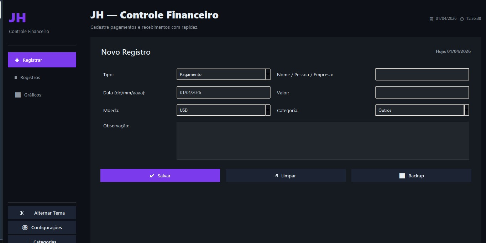
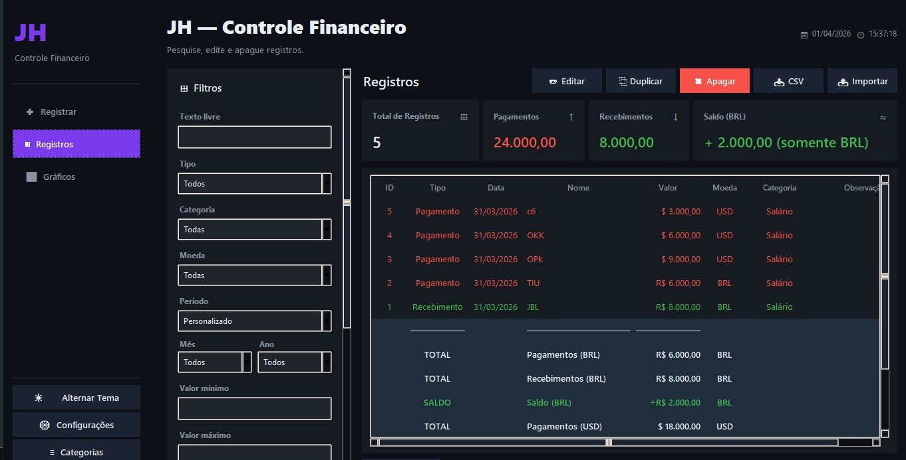
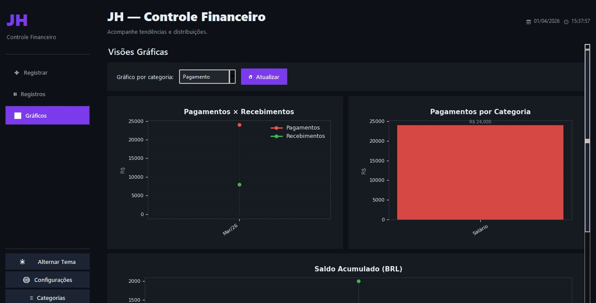
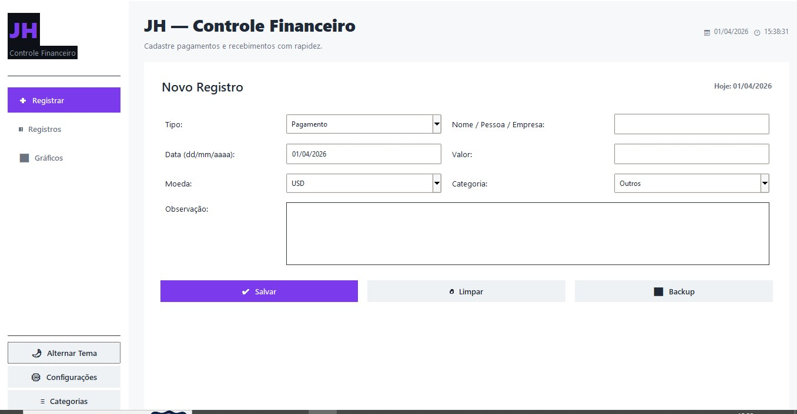
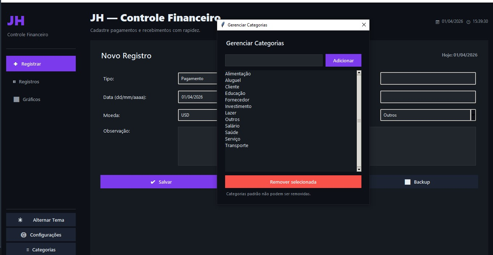

# JH · Controle Financeiro

Desenvolvida em Python, com interface gráfica Tkinter, persistência em SQLite e visualizações interativas via Matplotlib.


---

## Capturas de Tela

### Registrar


### Tabela de registros


### Visualização de gráficos


### Tema claro


### Gerenciador


---

## Funcionalidades

**Registro de transações**
- Pagamentos e recebimentos com tipo, nome/empresa, data, valor, moeda, categoria e observação
- Máscara automática no campo de data (dd/mm/aaaa) e valor (formato BR com vírgula decimal)
- Data de hoje preenchida automaticamente ao abrir o formulário
- Atalho `Enter` para navegar entre campos e `Ctrl+S` para salvar

**Busca e gestão**
- Filtros combinados: texto livre, tipo, categoria, moeda, mês, ano e período rápido
- Atalhos de período: Hoje, Esta semana, Este mês, Últimos 30 dias, Este ano
- Tabela interativa com ordenação por qualquer coluna (clique no cabeçalho)
- Cores por tipo: pagamentos em vermelho, recebimentos em verde
- Totais e saldo calculados automaticamente ao fim da tabela, por moeda
- Edição via duplo clique; exclusão com `Delete` ou botão dedicado
- Exportação para CSV (UTF-8 BOM, separador `;` — compatível com Excel BR)

**Gráficos**
- Evolução mensal de pagamentos × recebimentos (últimos 12 meses)
- Distribuição por categoria (Top 10, com valores inline)
- Saldo acumulado ao longo do tempo (BRL), com área colorida positivo/negativo
- Scroll vertical para ver os cards de resumo em qualquer resolução de tela

**Outras funcionalidades**
- Tema dark e light alternáveis sem reiniciar a aplicação
- Backup automático ao iniciar e ao fechar (rotação: máx. 15 arquivos)
- Backup manual com um clique
- Múltiplas moedas: BRL, USD, EUR, GBP, JPY
- Scroll do mouse isolado por região (tabela e filtros não interferem entre si)
- Relógio em tempo real no cabeçalho

---

## Tecnologias

| Camada | Tecnologia |
|---|---|
| Interface gráfica | Python Tkinter + ttk |
| Banco de dados | SQLite3 (stdlib) |
| Gráficos | Matplotlib 3.6+ |
| Backup e arquivos | shutil + datetime (stdlib) |
| Exportação | csv (stdlib) |

**Dependência externa única:** `matplotlib` — todo o resto usa a biblioteca padrão do Python.

---

## Instalação

### Pré-requisitos

- Python 3.9 ou superior
- pip

### Passos

```bash
# Clone o repositório
git clone https://github.com/Johnizio/JH-Controle_Financeiro.git
cd controle-financeiro

# (Recomendado) Crie um ambiente virtual
python -m venv .venv
source .venv/bin/activate      # Linux / macOS
.venv\Scripts\activate         # Windows

# Instale as dependências
pip install -r requirements.txt

# Execute
python app.py
```

O banco de dados (`controle_financeiro_ultra.db`) e a pasta `backups/` são criados automaticamente na primeira execução.

---

## Estrutura do Projeto

```
controle-financeiro/
├── app.py                           # Código-fonte principal (~2500 linhas)
├── requirements.txt                 # Única dependência: matplotlib
├── README.md                        # Este arquivo
├── .gitignore                       # Exclui .db, backups/, .venv/, __pycache__/
├── controle_financeiro_ultra.db     # Banco SQLite (gerado automaticamente, não versionado)
└── backups/                         # Backups automáticos (não versionados)
```

---

## Arquitetura

O projeto organiza responsabilidades em quatro classes dentro de um único arquivo:

```
app.py
│
├── Utilitários globais         → funções puras: parse de data, formatação de valor,
│                                 normalização de entrada, backup
│
├── FinanceiroDB                → toda a lógica de acesso ao SQLite
│   ├── CRUD (inserir, atualizar, excluir, obter_por_id)
│   ├── buscar()                → filtragem diretamente no SQL (WHERE parametrizado)
│   ├── dados_grafico_*()       → queries agregadas para os três gráficos
│   └── exportar_csv()
│
├── TreeTooltip                 → tooltip de data/hora sobre linhas da tabela
│
├── EditarRegistroDialog        → janela modal de edição (tk.Toplevel)
│
└── App (tk.Tk)                 → aplicação principal
    ├── _criar_aba_registrar    → formulário de cadastro
    ├── _criar_aba_busca        → painel de filtros + tabela de registros
    └── _criar_aba_graficos     → três gráficos Matplotlib embutidos + cards de resumo
```

---

## Decisões Técnicas

**Arquivo único** — todo o código vive em `app.py`. Facilita distribuição e execução sem configurar módulos ou estrutura de pacotes.

**SQLite sem ORM** — acesso direto via `sqlite3` da stdlib. Todas as queries usam parâmetros `?` (sem concatenação de strings), eliminando risco de SQL injection. Filtros de busca são aplicados no banco, não em memória Python.

**Scroll isolado por zona** — o scroll do mouse é ativado com `bind_all` somente quando o cursor entra em cada região (tabela ou painel de filtros) e desativado ao sair. Evita o comportamento padrão do Tkinter onde scroll em uma área interfere em outra.

**Tema sem reiniciar** — `_reaplicar_tema()` reconfigura todos os estilos `ttk.Style` e atualiza widgets `tk.*` manualmente. Nenhum widget é destruído ou recriado.

**Backup rotativo** — ao iniciar e ao fechar, o `.db` é copiado para `backups/` com timestamp. Se o total ultrapassar 15, os mais antigos são removidos automaticamente.

---

## Atalhos de Teclado

| Atalho | Ação |
|---|---|
| `Ctrl+S` | Salvar registro (aba Registrar) |
| `Ctrl+N` | Ir para aba Registrar |
| `Ctrl+F` | Ir para aba Busca e focar no campo de texto |
| `F5` | Atualizar tabela / Ver todos |
| `Delete` | Excluir registro selecionado na tabela |
| Duplo clique | Abrir edição do registro selecionado |
| `Enter` (campo Nome) | Mover foco para campo Valor |
| `Enter` (campo Valor) | Salvar registro |

---

## Melhorias Futuras

- [ ] Importação de CSV/Excel para cadastro em lote
- [ ] Filtro por intervalo de valor (mínimo e máximo) na UI de busca
- [ ] Gráfico de pizza com distribuição percentual por categoria
- [ ] Gerenciamento de categorias personalizadas (adicionar / renomear / remover)
- [ ] Relatório em PDF com resumo mensal
- [ ] Suporte a metas e orçamento por categoria com alertas visuais
- [ ] Tela de configurações (moeda padrão, tema inicial, número de backups)

---

## Desenvolvimento com IA

Este projeto foi desenvolvido com auxílio do **Claude e GPT** como ferramenta de programação assistida por IA. O processo foi iterativo:

- Decisões de arquitetura, funcionalidades e design tomadas pelo desenvolvedor
- Geração e refatoração de código com assistência da IA
- Identificação e correção de bugs em sessões de debugging — por exemplo: campo de valor transformando `1800` em `18.000.000` por erro no filtro de entrada; scroll global do mouse interferindo entre regiões distintas da janela; método de gráfico implementado no banco mas nunca conectado à interface
- Análise estática para detectar código morto, queries ineficientes e métodos sem cobertura na UI

O uso de IA foi tratado como qualquer outra ferramenta de desenvolvimento — com avaliação crítica do resultado a cada etapa.

---

## Autor

**Jhonatan Henrique Guimarães Fernandes**
- LinkedIn: https://www.linkedin.com/in/jhonatanguimaraes01/
